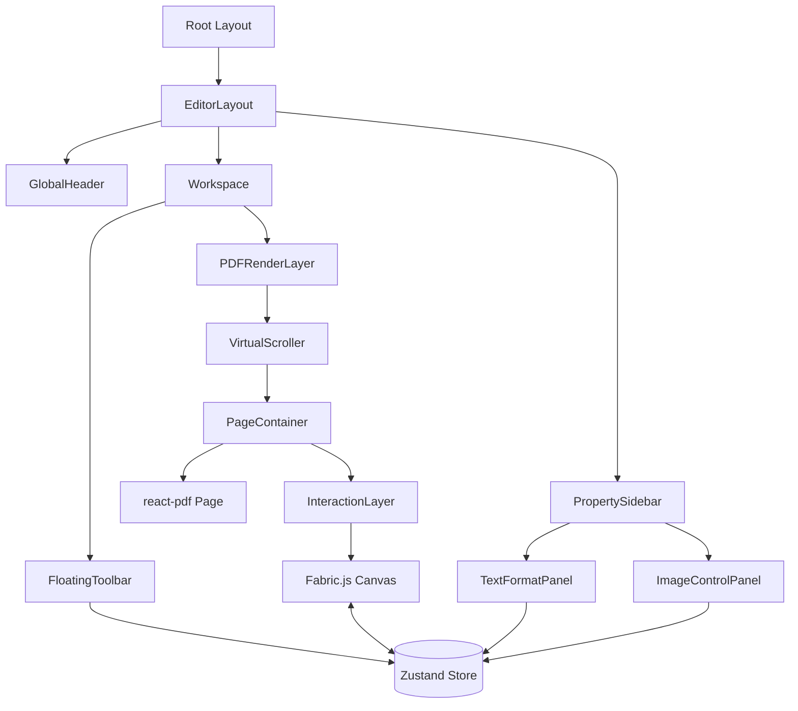

# Project Plan: FluxDoc

## 1. High-Level Architecture
The application follows a **Client-Heavy (Thick Client)** architecture to provide a responsive "desktop-like" editing experience. All interactive rendering and state management occurs in the browser.

### Core Architecture Layers
1.  **Frontend (View)**: Next.js 14+ (App Router) with React components.
2.  **State Layer**: Zustand (with Immer) for managing global store (`activeTool`, `selectedIds`, `annotations`, `pageDimensions`).
3.  **Rendering Layer**: 
    -   **Base**: Mozilla PDF.js (via `react-pdf`) for parsing and rendering the static PDF background.
    -   **Interactive**: HTML5 Canvas overlay (**Fabric.js v6**) for handling interactive objects.
4.  **Processing Layer (Future)**: Rust-based WASM module planned for parsing and binary reconstruction in later phases.

---

## 2. Technical Stack Specifications

### Framework & State
-   **Framework**: Next.js 14+ (App Router).
-   **Styling**: Tailwind CSS for atomic, hardware-accelerated transitions.
-   **State Management**: `Zustand` + `Immer`.

### Rendering & Editor Engine
-   **Base Rendering**: `react-pdf` (PDF.js wrapper).
-   **Canvas/Interaction**: Multi-layered stack (`PageContainer`):
    -   *Bottom*: PDF Page (rendered by `react-pdf`).
    -   *Middle*: `InteractionLayer` (Fabric.js canvas overlay).
    -   *Top*: `EditOverlay` (Internal Fabric.js text editing).

---

## 3. Detailed Implementation Logic

### A. The Editing Engine (Frontend)
**Layer Stack (PageContainer):**
1.  **PDF Layer**: Static SVG/Canvas rendering of the PDF page.
2.  **Fabric Layer**: Transparent canvas for object selection, moving, and resizing.
3.  **Annotation Sync**: 1-way synchronization from Zustand `annotations` store to Fabric.js objects using an `isSyncing` bridge to prevent update loops.

**Coordinate System:**
-   **Dimensions**: Page dimensions are captured on load via `onPageLoadSuccess` and stored in Zustand.
-   **Coordinate Sync**: Fabric objects use the same coordinate space as the PDF page dimensions.

---

## 4. Folder Structure
```text
edit-pdf/
├── app/                          # Next.js App Router
│   ├── layout.tsx                # Root layout (fonts, providers)
│   ├── page.tsx                  # Home page (editor entry)
│   └── globals.css               # Tailwind + CSS variables
│
├── components/
│   ├── layout/                   # Structural components
│   │   ├── EditorLayout.tsx      # Header + Workspace + Sidebar
│   │   ├── GlobalHeader.tsx      # Sticky top bar
│   │   └── PropertySidebar.tsx   # Right panel
│   │
│   ├── pdf/                      # PDF rendering
│   │   ├── PDFRenderLayer.tsx    # Document/Page wrapper
│   │   ├── VirtualScroller.tsx   # Virtualized page list
│   │   └── PageContainer.tsx     # 3-layer stack per page
│   │
│   ├── editor/                   # Interactive editing
│   │   ├── InteractionLayer.tsx  # Fabric.js canvas overlay
│   │   └── FloatingToolbar.tsx   # Tool selection buttons
│   │
│   └── panels/                   # Sidebar panels
│       ├── TextFormatPanel.tsx   # Font/Size/Color controls
│       └── ImageControlPanel.tsx # Interaction styles
│
├── stores/
│   └── editor-store.ts           # Zustand store (document, editor, history)
│
├── lib/
│   ├── types.ts                  # TypeScript interfaces
│   └── utils.ts                  # Helper functions
│
├── public/                       # Static assets
└── .gitignore                    # Comprehensive security rules
```

---

## 5. Application State Store (Zustand)

```typescript
interface AppState {
  document: {
    file: File | null;
    pageCount: number;
    pageDimensions: Record<number, { width: number; height: number }>;
    annotations: Record<number, Annotation[]>;
  };
  editor: {
    activeTool: 'SELECT' | 'TEXT' | 'IMAGE' | 'DRAW';
    selectedIds: string[];
    viewport: { 
        scale: number; 
        offsetX: number; 
        offsetY: number; 
        rotation: number; 
    };
  };
  history: {
    past: EditorAction[][];
    future: EditorAction[][];
  };
}
```

---

### Global Style Configuration (`globals.css`)
Tailwind CSS v4 uses CSS-based configuration. All theme tokens are defined via the `@theme` directive:

```css
@theme {
  --color-primary: #E5322D;
  --color-background: #F5F5FA;
  --color-surface: #FFFFFF;
  --color-text-primary: #33333B;
  --color-text-secondary: #666666;
  
  --shadow-card: 0 4px 6px rgba(0, 0, 0, 0.05);
  --shadow-floating: 0 8px 24px rgba(0, 0, 0, 0.12);
  
  --font-sans: var(--font-inter), system-ui, sans-serif;
}
```


---

## 7. Visual Architecture

### UI Layout (ASCII)
```text
+-----------------------------------------------------------------------+
|  FluxDoc Logo  |  Document Name        [ Undo ] [ Redo ]  [ Zoom +/- ] |
+----------------+------------------------------------------+-----------+
|                |                                          |           |
|  [ Sidebar ]   |              [ PDF PAGE 1 ]              | PROPERTY  |
|  (Optional     |                                          | PANEL     |
|   Thumbnails)  |        +------------------------+        |           |
|                |        |   Interaction Layer    |        | [ Font ]  |
|                |        |   (Fabric.js Canvas)   |        | [ Size ]  |
|                |        +------------------------+        | [ Color]  |
|                |                                          |           |
|                |              [ PDF PAGE 2 ]              |           |
|                |                                          |           |
|                |      +----------------------------+      |           |
|                |      | [Select] [Text] [Img] [Draw]|      |           |
+----------------+------------------------------------------+-----------+
```

### Component Hierarchy (Mermaid)


---

## 8. Project Roadmap (Status)

### Phase 1: Foundation & Viewer [DONE]
- [x] Next.js setup & Tailwind config.
- [x] `react-pdf` integration with virtual scrolling.
- [x] iLovePDF aesthetic implementation.

### Phase 2: Interactive Editor Core [DONE]
- [x] Viewport transform (Zoom) logic.
- [x] Fabric.js `InteractionLayer` implementation.
- [x] Selection model & drag-to-move support.

### Phase 3: Tools & Property Panels [DONE]
- [x] `FloatingToolbar` for tool switching.
- [x] `TextFormatPanel` & `ImageControlPanel` for property editing.
- [x] Object synchronization between Store and Canvas.

### Phase 4: Polish & Stability [DONE]
- [x] **Tailwind v4 Migration**: Moved design tokens to CSS `@theme` directive.
- [x] **UI Redesign**: Polished shadows, borders, and background to match target designs.
- [x] **TypeScript Stability**: Fixed property mismatches in `VirtualScroller` and `PageContainer`.
- [x] **Security Audit**: Implemented comprehensive `.gitignore` to prevent API key leaks.

### Phase 5: Persistence & WASM [PLANNED]
- [ ] Rust/WASM integration for binary PDF modification.
- [ ] Delta generation for incremental saves.
- [ ] Export pipeline implementation.
